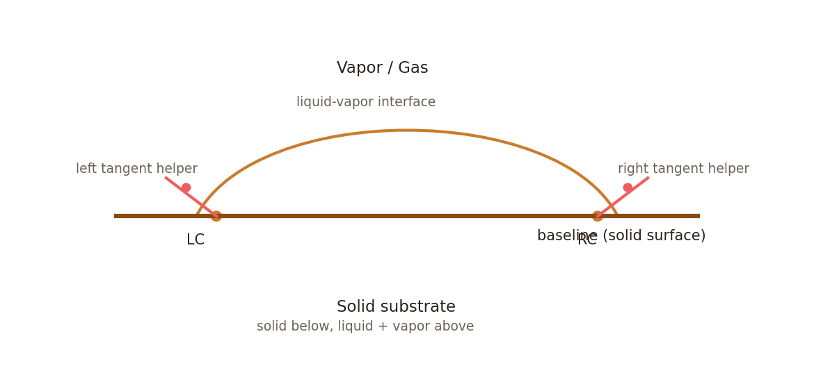

# Surface Lab

## 1) Get the web app from the GitHub main branch

### Option A: Clone the repository
```
git clone <YOUR_GITHUB_REPO_URL>
cd contact_angle_lab
git checkout main
```

### Option B: Download the ZIP from GitHub
1. Open the repository on GitHub.
2. Click **Code** -> **Download ZIP**.
3. Extract the ZIP and open the folder.

### Run the app
This is a static web app; open `index.html` in a browser.

If your browser blocks local file scripts, run a local server:
```
python -m http.server 8000
```
Then open `http://localhost:8000` and click `index.html`.

---

## 2) Schematic of phase boundaries, baseline, and tangent helpers



Legend
- LC / RC: left / right contact point (three-phase contact line)
- baseline: substrate plane; separates solid (below) from liquid + vapor (above)
- tangent helpers: second points used to define local tangent at contact points

The baseline defines the solid surface and is the reference line for contact
angles. It also separates the solid phase (below) from the liquid and vapor
phases (above). The contact points (LC/RC) lie on the three-phase contact line
where solid, liquid, and vapor meet. Tangent helpers define the local interface
tangent at each contact point for manual measurements.

---

## 3) Measurement techniques and technical background

### Manual points (four-point tangent method)
**Approach**
- Select two baseline points along the solid surface.
- Click four manual points in order: left contact, right contact, left tangent
  helper, right tangent helper.
- The local tangent at each contact point is defined by the vector from the
  contact point to its helper point.
- The contact angle is computed as the counter-clockwise angle from the
  baseline vector to the tangent vector, constrained to 0-180 degrees.

**Technical background**
This method approximates the local interface slope at the contact line using a
first-order tangent constructed from two points. It is suitable when the
droplet profile is noisy, non-axisymmetric, or when the region near the contact
line must be emphasized over global fits. The accuracy depends on pixel
resolution and the operator's ability to place the contact point and a nearby
tangent helper along the liquid-vapor interface. This is analogous to a local
goniometric measurement of the slope of the meniscus at the three-phase
contact line.

---

### Circle best-fit (spherical cap approximation)
**Approach**
- Select two baseline points.
- Add boundary points along the droplet profile (10+ recommended).
- Fit a circle to the boundary points.
- Intersect the fitted circle with the baseline to locate left/right contact
  points.
- The tangent at each contact point is perpendicular to the radius.
- The contact angle is computed from baseline to tangent (0-180 degrees).

**Technical background**
For small droplets dominated by surface tension, the profile can often be
approximated by a spherical cap. The best-fit circle provides a global estimate
of curvature, enabling robust tangent estimation even in noisy images. This
approach is commonly used when gravitational flattening is minimal (Bond number
<< 1). Deviations from a circular profile (large drops, high Bond number,
pinning, or anisotropy) can bias the result, so adequate sampling along the
entire perimeter is important.

---

### Ellipse best-fit (generalized cap approximation)
**Approach**
- Select two baseline points.
- Add boundary points along the droplet profile (15+ recommended).
- Fit a general conic constrained to an ellipse.
- Intersect the fitted ellipse with the baseline to locate left/right contact
  points.
- Compute the local tangent using the ellipse's conic gradient at each contact
  point.
- The contact angle is computed from baseline to tangent (0-180 degrees).

**Technical background**
Elliptical fits capture asymmetric or gravitationally deformed droplets better
than a circle. The conic representation provides a smooth, differentiable
profile; the tangent direction at any point is orthogonal to the gradient of
the implicit ellipse equation. This method can reduce bias for higher Bond
numbers or for droplets with anisotropic spreading, provided that boundary
points cover the full observable profile and that the ellipse fit is stable.

---

### Both fits (circle + ellipse)
**Approach**
- Compute both circle and ellipse fits from the same boundary points.
- Report the average of the two contact angles for each side.

**Technical background**
This hybrid approach offers a pragmatic cross-check between two geometric
assumptions. Averaging reduces sensitivity to model mismatch when the true
profile lies between circular and elliptical behavior. Researchers can compare
the individual fits to assess model error or use the mean as a conservative
estimate when neither model perfectly captures the droplet shape.

---

### Pendant drop (Young-Laplace fit for surface tension)
**Approach**
- Add boundary points along the full pendant profile (12-30 recommended).
- Provide density difference (Delta rho) and scale (mm/px), or calibrate scale
  using a known distance (e.g., needle diameter).
- Fit the Young-Laplace profile to the boundary points.
- Report surface tension and apex radius from the fitted capillary constant.

**Technical background**
Pendant drop analysis solves the Young-Laplace equation for an axisymmetric
interface under gravity. The profile is parameterized by the apex radius R0 and
capillary constant b. With density difference Delta rho and gravity g, surface
tension is computed from gamma = Delta rho * g / b. This method is sensitive to
scale calibration and requires adequate sampling of the full profile to
stabilize the fit.
